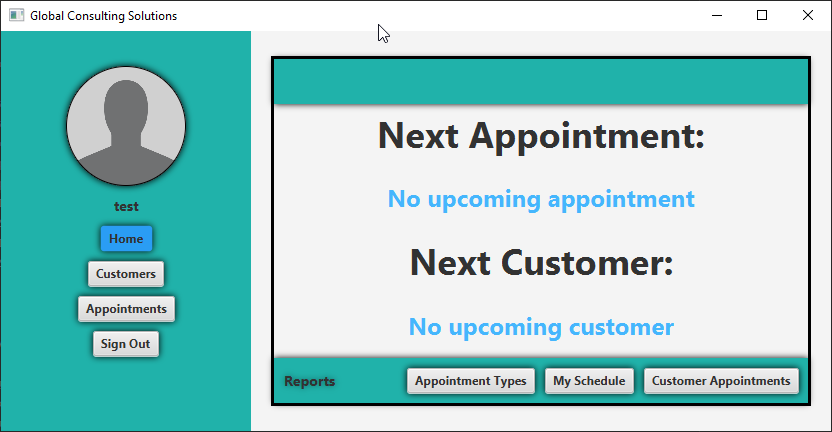
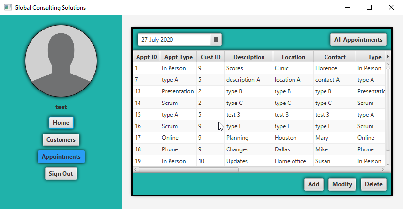

#CRM Software
A customer relationship management application for a fictitious company called Global Consulting Services built using Java and JavaFX (with Scenebuilder).

### Installation
**Note**: This application is only for educational purposes.  It will attempt to connect to a local host.
 If trying to run the build on your local machine, copy the database schemas in the structures_dump
 folder.
 1. Clone the repository
 2. Use the structures_dump files to replicate the database on your local machine.
 3. Modify the DBCConnection file to connect to your DB.
 4. Run the Main.java file. (Create a username and pass in the user table in your local DB server and login using those credentials).

 ### Features
 * Full CRM application that has a login page. (login is for demonstration purposes, credentials are not encrypted).
 * Allows for each user to create their own customers and appointments.
 * Alerts and Error messages when user violates DBMS rules.

### Project Takeaways
**Establishing DB Connection**: Using Java's mySQL JDBC API to connect to database.

**DAO Design Pattern**: Utilizes data access object(DAO) design pattern to abstract database related code from
application code.

**Application Security**: Implementing a login page to validate an authorized user of the connected database.

### Images
**Login screen**:

**Dashboard**:

**Customers screen**:

**Appointments screen**:

